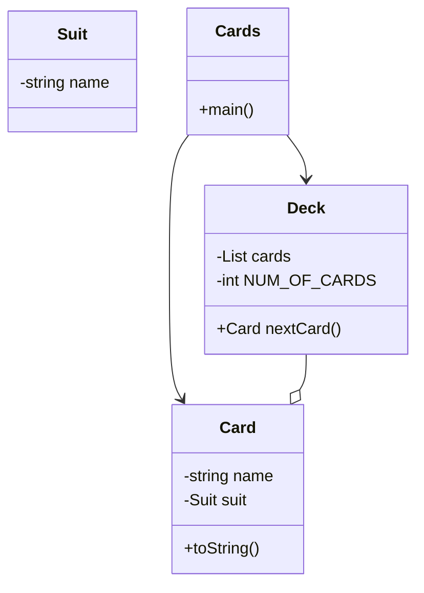

```mermaid
classDiagram
    class Suit{
        -string name
    }
    class Card{
        -string name
        -Suit suit
        +toString()
    }
    class Deck {
        -List<Card> cards
        -int NUM_OF_CARDS
        
        +Card nextCard()
    }
    class Cards {
        +main()
    }
    Cards --> Deck
    Cards --> Card
    Deck --o Card
```